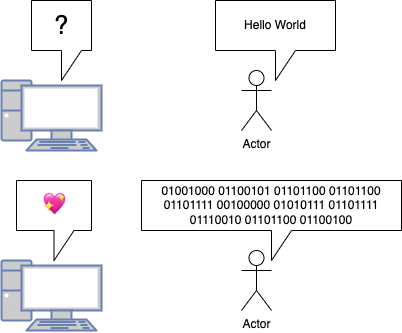

# プログラミング導入

---

# 目的

プログラミングの楽しさ，便利さを知ってもらい，プログラミングに興味を持ってもらうこと

---

# 目次

- プログラムとは
  1.  プログラムって何？
  1.  プログラムが使われている場所
  1.  プログラムが実行されるまで
- プログラムができると(書ける)と何が嬉しいの？
- 演習をしながらプログラミングの基礎を学ぼう

  1. たくさんのファイルから欲しいデータを取得しよう

- 勉強方法など

---

# プログラミングとは

---

# プログラミングってなに？

簡単にいうと

## コンピューターにやって欲しいことを「プログラミング言語」で記述すること

```python
images_directory = input()
image = get_images(f"{image_directory}/*.jpeg")
cat_dog_predictor = ai_model()
for image in images :
    predict = cat_dog_predictor.predict(image)
    if predict == 0 :
        print(f"{image_name} is DOG")
    else:
        print(f"{image_name} is CAT")
```

指定したフォルダーに格納されている写真を,犬か猫か AI に判断させて,
結果を教えてもらうようにお願いしている

---

# プログラミング言語ってなに？

コンピュータにやって欲しいことを記述するときに用いる言語

- いっぱい種類がある
  - c/c++
  - python
  - javascript/typescript
  - java
  - rust
  - ...
- 各々に得意分野があるので，やりたいことに合わせて言語を選ぶことが大事

---

# なんでプログラミング言語って必要なの？

---
# 前提1：コンピュータは0と1しか理解できない




---
# プログラミング言語は0,1に変換される

---

# なんで普通の文章でプログラム書けないの？

メールで人にお願いするみたいに，いつも使う文章(自然言語)でお願いできないのか？
<br>


## 結論:ニュアンスで読み取る人間すごすぎ

---

# プログラミング言語で書くことの利点

前のページでは，コンピュータが曖昧さを許さないことがわかった
だからと言って，プログラミング言語で書くことの利点にはならない
