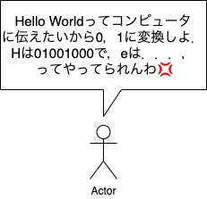
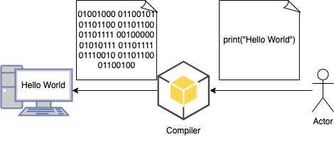

# プログラミング導入

---

# 目的

プログラミングの楽しさ，便利さを知ってもらい，プログラミングに興味を持ってもらうこと

---

# 目次

- プログラムとは
  1.  プログラムって何？
  1.  プログラムが使われている場所
  1.  プログラムが実行されるまで
- プログラムができると(書ける)と何が嬉しいの？
- 演習をしながらプログラミングの基礎を学ぼう

  1. たくさんのファイルから欲しいデータを取得しよう

- 勉強方法など

---

# プログラミングとは

---

# プログラミングってなに？

簡単にいうと

## コンピューターにやって欲しいことを「プログラミング言語」で記述すること

```python
images_directory = input()
images = get_images(f"{image_directory}/*.jpeg")
cat_dog_predictor = ai_model()
for image in images :
    predict = cat_dog_predictor.predict(image)
    if predict == 0 :
        print(f"{image_name} is DOG")
    else:
        print(f"{image_name} is CAT")
```

指定したフォルダーに格納されている写真を,犬か猫か AI に判断させて,
結果を教えてもらうようにお願いしている

---

# プログラミング言語ってなに？

コンピュータにやって欲しいことを記述するときに用いる言語

- いっぱい種類がある
  - c/c++
  - python
  - javascript/typescript
  - java
  - rust
  - ...
- 各々に得意分野があるので，やりたいことに合わせて言語を選ぶことが大事

---

# なんでプログラミング言語って必要なの？

---
# 前提1：コンピュータは0と1しか理解できない


### 文字も画像も全てコンピュータ内部では0と1の組み合わせで表現されている
ex) H -> 01001000,e -> 011000101,l -> 01101100, o -> 01101111 


---
# 前提2:ほとんどの人は0と1で物事を表現できない


本当にすごい人はできますが．．．

---
# 前提まとめ
```
コンピュータは0,1だけで物事を表現する
人間は0,1だけで物事を表現するのは苦手
```

## 人間がコンピュータに指示を出すのは何かしらの工夫が必要
人間の言葉を0,1に変換(翻訳)してくれる仕組みがあれば．．．
# それがプログラミング言語！！
(正確にはコンパイラ(後述))


---
# プログラミング言語は0,1に変換される
プログラミング言語はコンパイラによって0,1に変換される
<br>


### つまりプログラミング言語は人間とコンピュータの仲介人みたいなもの

---
# プログラムの例(Python)
```python
# コンピュータにHello Worldと文字が出る(出力される)
print("Hello World")

# 四則演算
a = 1 + 1
b = 2 * 2
c = 3 / 3 
print(a,",",b,",",c)
# 2,4,1

# 文字の合成
python = "P" + "y" + "t" + "h" + "o" + "n"
print(python)
# Python

```
---

# なんで普通の文章でプログラム書けないの？
プログラムは0,1に変換される


---

# なんで普通の文章でプログラム書けないの？

メールで人にお願いするみたいに，いつも使う文章(自然言語)でお願いできないのか？
<br>


結論：具体的な指示を出さないとコンパイラは理解できない！！

---

# プログラミング言語で書くことの利点

前のページでは，コンピュータが曖昧さを許さないことがわかった
だからと言って，プログラミング言語で書くことの利点にはならない
